# SymboleoAC ontology

This folder holds the **SymboleoAC metamodel** and the code artifacts generated
from it. SymboleoAC is an access-control–aware extension of the Symboleo smart
contract modeling language: a **Symboleo legal core** (contracts, roles, parties,
assets, obligations, powers, and the situation/event/time machinery) plus an
**Access-Control layer** (resources, policies, rules, operations, credentials).

## Contents

| Path | What it is |
| --- | --- |
| [`SymboleoAC.ump`](SymboleoAC.ump) | **Authoritative source of truth.** The [Umple](https://cruise.umple.org/umple/) model defining all 23 classes, 2 enumerations, their associations, and the `Contract`/`Obligation`/`Power` state machines. |
| [`Java/`](Java) | Java classes generated from `SymboleoAC.ump` by the Umple tool (one file per class). Regenerate whenever the `.ump` changes. |
| [`core/`](core) | The JavaScript runtime classes — one per ontology concept — translated from the generated Java. This is what the published `symboleoac-js-core` package ships. |
| [`diagrams/`](diagrams) | **Readable UML class diagrams** of the metamodel (Mermaid + SVG), colour-coded by layer, with a full class reference. See [`diagrams/README.md`](diagrams/README.md). |

## Generation flow

```
SymboleoAC.ump  ──Umple──▶  Java/  ──translated──▶  core/  (published to npm)
      │
      └──────────────────▶  diagrams/  (UML class diagrams: Mermaid + SVG)
```

Keep `SymboleoAC.ump` as the single point of edit; the `Java/` binding, the
`core/` implementation, and the `diagrams/` are all downstream of it.

## Class diagrams

Previews of the two layers — see [`diagrams/`](diagrams) for the complete
overview and the per-class documentation.

**Symboleo legal core**



**Access-Control layer**


