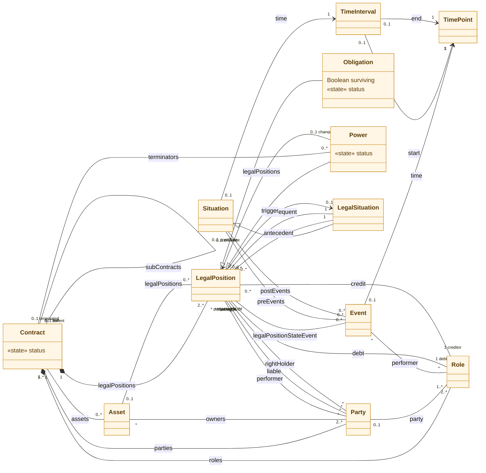
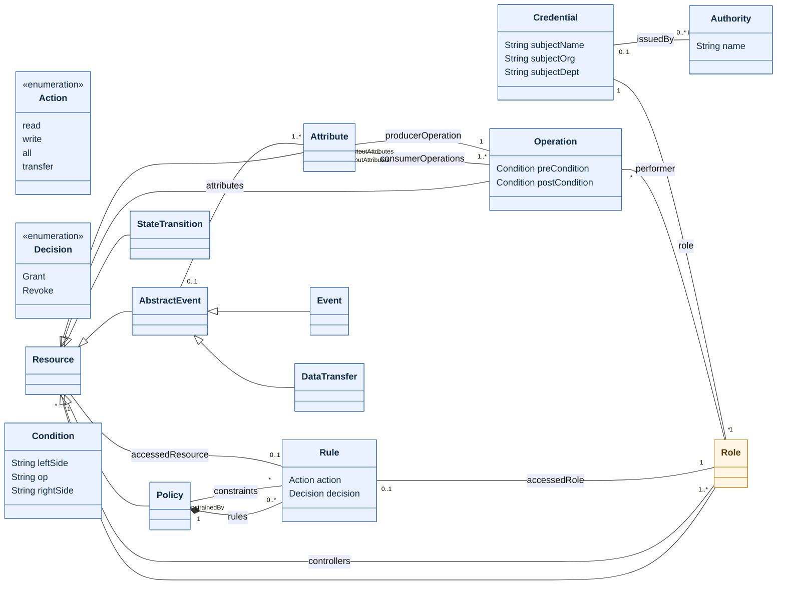

# SymboleoAC metamodel — UML class diagrams

Readable UML class diagrams of the **SymboleoAC** metamodel, generated from the
authoritative Umple source [`../SymboleoAC.ump`](../SymboleoAC.ump).

SymboleoAC has two layers, colour-coded in every diagram:

| Colour | Layer | Purpose |
| --- | --- | --- |
| 🟠 amber | **Symboleo legal core** | The legal ontology: contracts, roles, parties, assets, obligations, powers, and the situation/event/time machinery they are defined over. |
| 🔵 blue | **Access-Control (AC) layer** | The `//For Access Control` classes: resources, policies, rules, operations, attributes, credentials — the model that drives on-chain authorization. |

The bridge between the layers is `Resource`: the core classes `Contract`, `Role`,
`Asset`, and `LegalPosition` all specialize `Resource`, so anything legally
meaningful is also a controllable resource that a `Policy`'s `Rule`s can grant or
revoke access to.

Because the full model is large (23 classes, 2 enumerations, ~40 associations),
it is presented as **two focused views** plus one **complete overview**. Each
view exists as GitHub-rendered Mermaid (below), a standalone `.svg`, and its
`.mmd` source.

## Files

| File | What it is |
| --- | --- |
| [`SymboleoAC-core.svg`](SymboleoAC-core.svg) · [`.mmd`](SymboleoAC-core.mmd) | Symboleo legal core view |
| [`SymboleoAC-access-control.svg`](SymboleoAC-access-control.svg) · [`.mmd`](SymboleoAC-access-control.mmd) | Access-Control layer view |
| [`SymboleoAC-overview.svg`](SymboleoAC-overview.svg) · [`.mmd`](SymboleoAC-overview.mmd) | Complete model, both layers in one diagram |

---

## View 1 — Symboleo legal core



## View 2 — Access-Control layer

`Role` (amber) is drawn as the shared anchor with the legal core.



## Complete overview

Both layers in a single diagram. It is intentionally dense — use it as a
reference and open the [SVG](SymboleoAC-overview.svg) to zoom.

<details>
<summary>Show the combined Mermaid diagram</summary>

See [`SymboleoAC-overview.mmd`](SymboleoAC-overview.mmd) for the source, or the
[rendered SVG](SymboleoAC-overview.svg).

</details>

---

## Class reference

### Symboleo legal core

| Class | Key features |
| --- | --- |
| **Contract** `isA Resource` | The agreement. Composes ≥2 `LegalPosition`s and ≥2 `Role`s; associates `Party`s, `Asset`s, sub-contracts, and the `Power`s that may terminate it. Carries a **state machine** (`status`). |
| **Party** | A legal person that plays roles. |
| **Role** `isA Resource` | A role in the contract (e.g. buyer, seller); `debtor`/`creditor` of legal positions; played by at most one `Party`. |
| **Asset** `isA Resource` | A thing the contract is about; owned by parties. |
| **LegalPosition** `isA Resource` | Abstract parent of `Obligation`/`Power`. Has a debtor and creditor `Role`, `performer`/`liable`/`rightHolder` parties, an `antecedent`/`consequent`/`trigger` `LegalSituation`, and a `StateTransition`. |
| **Obligation** `isA LegalPosition` | A duty. `Boolean surviving` marks surviving obligations. Own **state machine** (Create → InEffect → Fulfillment/Violation/Discharge/…). |
| **Power** `isA LegalPosition` | A capability to change the state of other legal positions (`changeState`). Own **state machine** (InEffect → exerted/expired/…). |
| **Situation** | A state of affairs bounded by pre/post `Event`s and a `TimeInterval`. |
| **LegalSituation** `isA Situation` | A situation with legal meaning; carries `Attribute`s and `DataTransfer` data. |
| **Event** `isA AbstractEvent` | Something that happens at a `TimePoint`, performed by `Role`s. |
| **TimeInterval** | A `start`/`end` pair of `TimePoint`s. |
| **TimePoint** | An instant. |

### Access-Control layer

| Class | Key features |
| --- | --- |
| **Resource** | Root of anything controllable; has ≥1 `Role` controllers. Parent of `Contract`, `Role`, `Asset`, `LegalPosition`, `Policy`, `Operation`, `Attribute`, `StateTransition`, `AbstractEvent`. |
| **Policy** `isA Resource` | Composes `Rule`s and references constraint rules. |
| **Rule** | `action: Action`, `decision: Decision`; targets one `accessedResource` and one `accessedRole`. |
| **Operation** `isA Resource` | A performable operation with `preCondition`/`postCondition : Condition`, performed by `Role`s, consuming/producing `Attribute`s. |
| **Attribute** `isA Resource` | Data element; input to / output of `Operation`s. |
| **AbstractEvent** `isA Resource` | Parent of `Event` and `DataTransfer`; carries `Attribute`s. |
| **DataTransfer** `isA AbstractEvent` | A data-transfer event linked to a `LegalSituation`. |
| **StateTransition** `isA Resource` | A legal-position state transition, treated as a controllable resource. |
| **Condition** | `leftSide`/`op`/`rightSide` triple used by `Operation` pre/post-conditions. |
| **Credential** | `subjectName`/`subjectOrg`/`subjectDept` bound to exactly one `Role`, issued by an `Authority`. Makes the runtime X.509 → Role binding (incl. the `dept` requirement) first-class rather than folklore. |
| **Authority** | A credential issuer (e.g. a certificate authority); `name`. |

### Enumerations

- **Action** — `read`, `write`, `all`, `transfer`
- **Decision** — `Grant`, `Revoke`

### Stateful classes

`Contract`, `Obligation`, and `Power` each declare an Umple `status` state
machine (shown as `«state» status`). Summaries:

- **Contract**: `Form` → `InEffect`; while active it can be `Suspension`,
  `Unassign`, `Rescission` (final), or terminate to `SuccessfulTermination` /
  `UnsuccessfulTermination`.
- **Obligation**: `Create` → `InEffect`; ends in `Fulfillment`, `Violation`,
  `Discharge`, or `UnsuccessfulTermination`; can be `Suspension`/resumed.
- **Power**: `Create` → `InEffect`; ends in `SuccessfulTermination` (exerted) or
  `UnsuccessfulTermination` (expired/terminated); can be `Suspension`/resumed.

See [`../SymboleoAC.ump`](../SymboleoAC.ump) for the full transition definitions.

---

## Regenerating the diagrams

The SVGs are rendered from the `.mmd` sources with
[`@mermaid-js/mermaid-cli`](https://github.com/mermaid-js/mermaid-cli):

```bash
npx @mermaid-js/mermaid-cli -i SymboleoAC-core.mmd            -o SymboleoAC-core.svg            -b transparent
npx @mermaid-js/mermaid-cli -i SymboleoAC-access-control.mmd  -o SymboleoAC-access-control.svg  -b transparent
npx @mermaid-js/mermaid-cli -i SymboleoAC-overview.mmd        -o SymboleoAC-overview.svg        -b transparent
```

The `.mmd` sources were hand-derived from [`../SymboleoAC.ump`](../SymboleoAC.ump)
(one class, generalization, and association at a time) so they stay faithful to
the metamodel. If the `.ump` changes, update the `.mmd`s and re-render. The Java
binding in [`../Java/`](../Java) is generated separately by Umple from the same
`.ump`.
